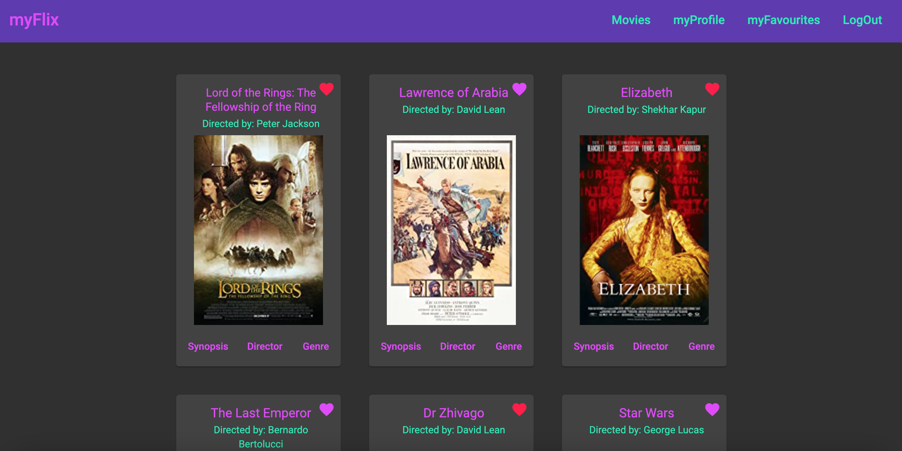

# MyFlixAngularClient 🎬



MyFlixAngularClient is a dynamic web application that allows movie enthusiasts to explore information about classic films. It consumes the [myFlix API](https://github.com/Penny167/myFlix) with a front end built using Angular. The project was generated with the [Angular CLI](https://github.com/angular/angular-cli) version 13.0.4 and is written in TypeScript.

## Live website

Visit myFlixAngularClient [here](https://penny167.github.io/myFlix-Angular-client/welcome) and sign up to explore the app!

## Key Features

- A welcome page invites users to log in to or register for the app. Buttons bring up dialogs for each option with forms for the user to complete. Tooltips display the requirements for the fields on the registration form.
- A successful login takes registered users to the main view where all the movies from the database connected to the API are displayed. Movies are presented as cards that show the movie title, director and image from the IMDb.
- Buttons on the cards allow users to explore further details. By clicking on synopsis, director or genre a dialog pops up to display the information.
- Users can create a collection of favourite movies that they can navigate to from the main page by selecting myFavourites from the navigation menu (on smaller screens this option is presented as a heart icon on a hamburger menu). Movies are added to or removed from favourites by clicking on a heart icon displayed on each card. Adding a movie to favourites turns the heart icon red.
- In addition to the main view and favourites view there is a profile view where users can either edit the credentials they provided at registration or deregister from the application.
- Users navigate the site via a responsive navbar that collapses to a hamburger menu at mobile screen sizes. The navigation component encloses the views available and switches between them based on the user's selection.
- The application uses Angular Material to provide UI components including the responsive navbar, the cards, buttons, dialogs, snackbars and tooltips.
- myFlixAngularClient interacts with the database holding the movie and user data using the myFlix API. Requests to the API are made using a service module injected in to the root component that is configured using Angular's HttpClient class.
- The completed app has been published to github pages and is accessible via the live website link above.

## Technologies
- Angular
- Angular Material

## Installation and set up
This project requires npm in order to install package dependencies. npm is installed automatically when installing node.js. The relevant documentation can be found [here](https://nodejs.org/en/).
Once npm is installed, install the project dependencies by running: 
```
npm install
```
Next you need to install the Angular CLI:
```
npm install -g @angular/cli
```
You will now be able to run CLI commands inside the project. To start the project locally using a dev server run:
```
ng serve 
```
Navigate to `http://localhost:4200/`. The app will automatically reload if you change any of the source files.

You can build the project and publish to your own github pages website by creating a github repository then using angular-cli-ghpages (which is installed as a project dependency) to deploy to a github pages branch. Ensure any changes are pushed to your main branch, checkout a gh-pages branch, merge your main branch into the gh-pages branch and push the changes. Then run the command:
```
ng deploy --base-href=/<your-repository-name>/
```
Your live app will now be published at the github pages URL!

## Further help

To get more help on the Angular CLI use `ng help` or check out the [Angular CLI Overview and Command Reference](https://angular.io/cli) page.

## Author
Github: [@penny167](https://github.com/Penny167)
